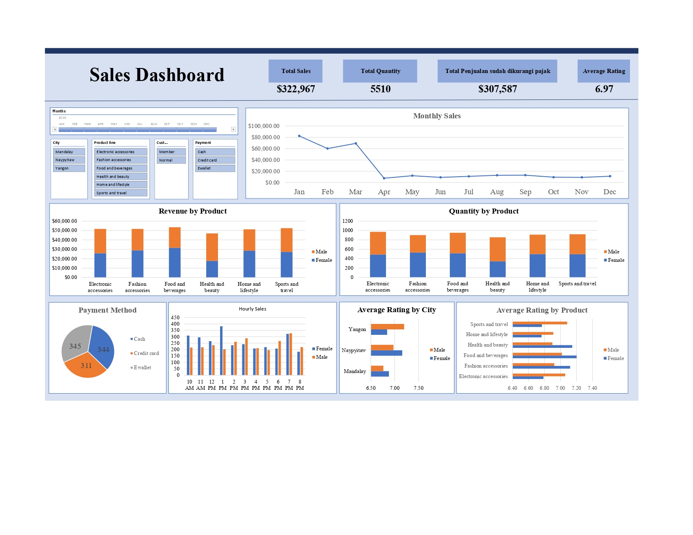

# 📊 Supermarket Sales Performance Dashboard (Excel)

## 📌 Project Overview
Proyek ini berisi *dashboard* analitik interaktif yang dibangun sepenuhnya menggunakan **Microsoft Excel** untuk memantau performa penjualan sebuah supermarket. *Dashboard* ini dirancang menggunakan *Slicers* interaktif yang memungkinkan manajemen untuk memfilter data berdasarkan bulan, kota (Mandalay, Naypyitaw, Yangon), kategori produk, tipe pelanggan, dan metode pembayaran.

**🛠️ Tools & Technologies:**
* **Visualisasi & Reporting:** Microsoft Excel (Pivot Tables & Pivot Charts)
* **Data Processing:** Data Cleaning, Aggregation, & Filtering
* **Data Source:** `Data Supermarket-Latihan.xlsx`

---

## 🖼️ Dashboard Preview


---

## 💡 Key Business Insights
Berdasarkan visualisasi data pada *dashboard*:
* **Kinerja Utama (KPI):** Supermarket mencatatkan total pendapatan kotor sebesar $322,967 (atau $307,587 setelah dikurangi pajak) dengan total 5.510 kuantitas barang terjual, serta rata-rata rating kepuasan pelanggan di angka 6.97.
* **Tren Penjualan Bulanan:** Penjualan tertinggi terjadi pada kuartal pertama (Januari - Maret) yang menyentuh angka di atas $60,000 per bulan, namun mengalami penurunan drastis memasuki bulan April dan cenderung stagnan hingga akhir tahun.
* **Preferensi Pembayaran:** Penggunaan *E-wallet* (345 transaksi) dan *Cash* (344 transaksi) mendominasi metode pembayaran pelanggan, sedikit mengungguli penggunaan Kartu Kredit (311 transaksi).
* **Perilaku Konsumen (Waktu Tersibuk):** Volume transaksi harian mengalami lonjakan paling signifikan (*Peak Hours*) pada pukul 19:00 (7 PM), mengindikasikan tingginya kunjungan pelanggan setelah jam pulang kerja.
* **Kinerja Produk & Demografi:** Kategori *Food and beverages* dan *Sports and travel* merupakan kontributor pendapatan terbesar di antara 6 lini produk[cite: 2]. Secara demografis, proporsi pembelian antara pelanggan pria dan wanita terdistribusi cukup merata.

---

## 📁 Repository Structure
```text
├── Sales Data and Dashboard.xlsx   # Dataset mentah beserta sheet Dashboard Excel
├── Dashboard Preview.jpg                   # Gambar tangkapan layar dashboard
└── README.md                       # Dokumentasi proyek
